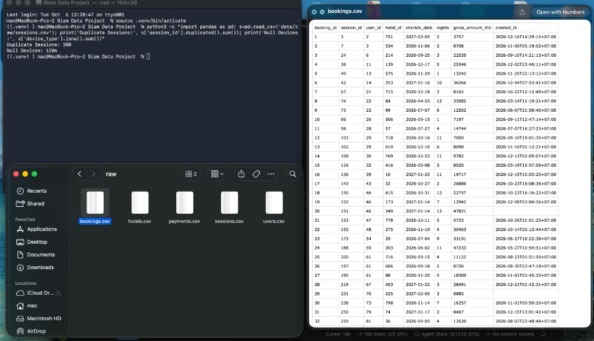

# Project SiamStay

SiamStay is a Southeast Asia online travel agency whose Q3 2026 sessions grew while gross bookings did not. This portfolio project defines the booking funnel and 90-day repeat retention, then generates a fully synthetic extract an analyst can use to measure device and payment-method drop-off without touching production data.

**ALL data in this project is synthetic.** Every row in `data/raw/` is produced by `scripts/generate_data.py`. The files do not describe real travelers, real bookings, or real payments. Names and emails are never written; the published schema has no identity columns.

Phase 1 is the measurement contract and the raw extract only. ETL and the database are Phase 2 and are intentionally not in this repository yet.

## Day 1 sanity check

The raw extract is checked before anything is modeled. This pass confirms the file grain: 300 extra duplicate `session_id` values, and 1,206 blank `device_type` values in the session file (1,200 distinct sessions, plus copies of those rows).



## Folder structure

```
.
├── README.md
├── requirements.txt
├── .gitignore
├── data/
│   └── raw/
│       ├── users.csv
│       ├── sessions.csv
│       ├── bookings.csv
│       ├── payments.csv
│       └── hotels.csv
├── docs/
│   ├── PRD.md
│   ├── DATA_DICTIONARY.md
│   ├── answer_key.md      # local ground truth, gitignored
│   └── images/
│       └── day1-sanity-check.jpg
└── scripts/
    └── generate_data.py
```

`docs/answer_key.md` records the injected-defect rules and the seed-42 magnitudes for private self-checks. It is listed in `.gitignore` and is not for publication.

## Run

From the project root, with the pinned stack:

```bash
python3 -m venv .venv
source .venv/bin/activate
pip install -r requirements.txt
python scripts/generate_data.py
```

The script creates `data/raw/` and overwrites the five CSVs. Seeds are fixed (NumPy 42, Faker 42). A second run on these pinned versions is byte-identical. The process ends by printing row counts, funnel conversion rates, and injected-anomaly counts.

Column definitions and KPI formulas live in `docs/DATA_DICTIONARY.md` and `docs/PRD.md`.
